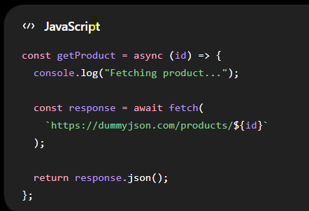
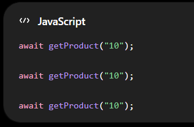
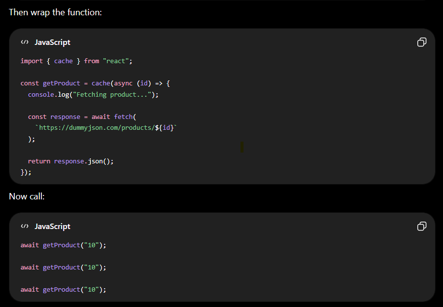
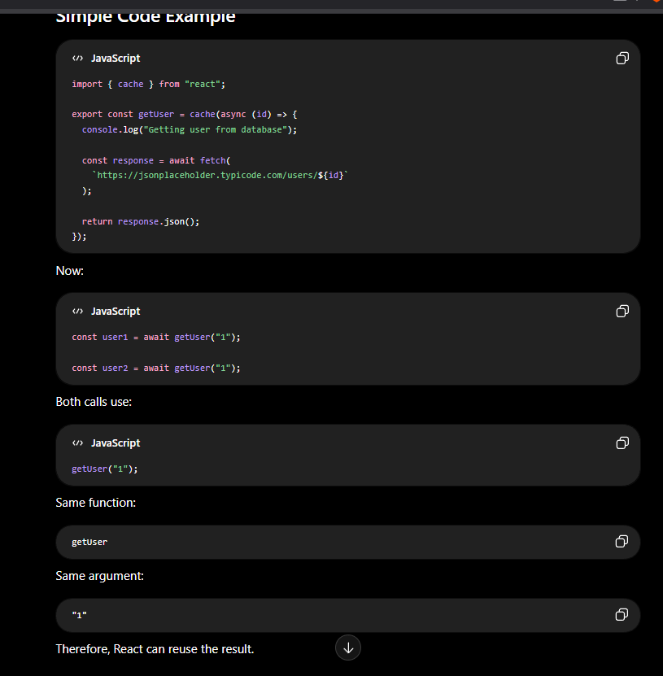
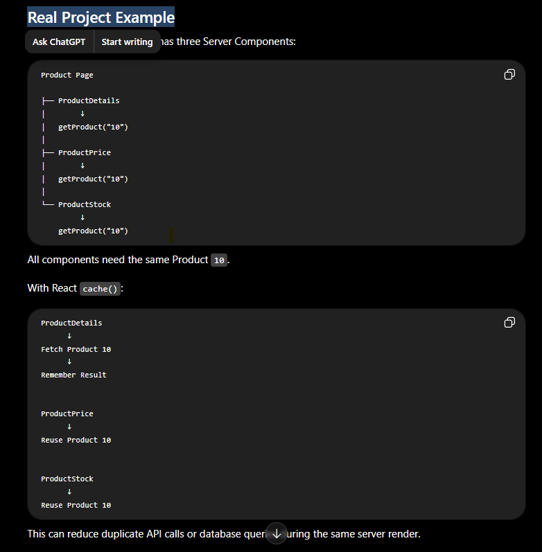
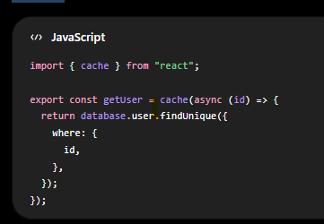
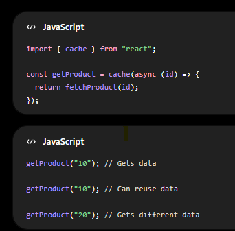

React cache() in Simple Words – Next.js
What is cache()?

React cache() remembers the result of a server-side function so that if the same function is called again with the same value, React can reuse the previous result instead of doing the same work again.

Simple meaning:

Do the work once, remember the result, and reuse it when the same data is requested again.

Real-Life Example

Imagine you go to a library and ask:

“Give me the React book.”

The librarian searches for the React book and gives it to you.

After five minutes, you ask again:

“Give me the same React book.”

Instead of searching again, the librarian remembers where the book is and gives it to you directly.

This is similar to caching.

First Request
      ↓
Search for React Book
      ↓
Find the Book
      ↓
Remember the Result

Second Same Request
      ↓
Use Remembered Result
      ↓
No Need to Search Again

Without React cache()

Suppose three components need information about Product 10.

Product Details
      ↓
Fetch Product 10
      ↓
API/Database Call

Product Price
      ↓
Fetch Product 10
      ↓
API/Database Call Again

Product Stock
      ↓
Fetch Product 10
      ↓
API/Database Call Again

The same data may be requested repeatedly.

Code:

calls: 

Conceptually:

API Call 1

API Call 2

API Call 3

The same work is repeated

With React cache()

First, import cache:

import { cache } from "react";

Conceptually:

First Call
getProduct("10")
        ↓
Fetch Product
        ↓
Remember Result

Second Call
getProduct("10")
        ↓
Reuse Remembered Result

Third Call
getProduct("10")
        ↓
Reuse Remembered Result

What If the Arguments Are Different?
getUser("1");

getUser("2");

These are different users.

React cannot return User 1 for User 2.

Therefore:

getUser("1")
      ↓
Get User 1

getUser("2")
      ↓
Get User 2

Each different argument has its own result.

Real Project Example

Why Do We Use cache()?

We use React cache() to:

Avoid repeating the same server-side work
Avoid duplicate database queries
Avoid duplicate API calls
Improve server rendering efficiency
Reuse results when the same data is requested
Where Is React cache() Used?

React cache() is mainly used with:

Next.js Server Components
Server-side data-fetching functions
Database queries
API calls
User data
Product data

Example:

Is cache() Permanent Storage?

No.

React cache() does not store data permanently.

It is not like:

MongoDB
MySQL
Redis
localStorage
sessionStorage

Think of it as short-term memory used during React's server rendering/cache scope.

React cache() vs Database
React cache()	Database
Temporarily remembers function results	Permanently stores application data
Avoids repeated work	Stores users, products, orders, etc.
Used for performance	Used for data storage
Does not replace a database	Main data source
React cache() vs localStorage
React cache()	localStorage
Mainly server-side	Browser-side
Memoizes function results	Stores values in the user's browser
Used for server efficiency	Used for browser persistence
Not permanent application storage	Remains until cleared
Important Interview Questions
Q1. What is React cache()?

Answer:

React cache() is a server-side memoization function. It remembers the result of a function and reuses it when the same cached function is called again with the same arguments during the same cache scope.

Q2. Why do we use cache()?

Answer:

We use cache() to avoid duplicate server-side work, such as repeated database queries or API calls.

Q3. What happens if the arguments are the same?

Example:

getUser("10");

getUser("10");

Answer:

React can reuse the previously memoized result because the cached function and its arguments are the same.

Q4. What happens if the arguments are different?

Example:

getUser("10");

getUser("20");

Answer:

React executes the function separately because the arguments are different.

Q5. Is React cache() permanent?

Answer:

No. React cache() is not permanent storage. It is mainly used to memoize server-side function results within React's cache lifetime.

Q6. Where do we import cache() from?
import { cache } from "react";
Short Interview Answer

React cache() remembers the result of a server-side function. When the same cached function is called again with the same arguments during the same server rendering scope, React can reuse the previous result instead of repeating the API call or database query.

Example:

Easy Way to Remember

First Same Request
        ↓
Do the Work
        ↓
Remember Result

Second Same Request
        ↓
Reuse Result
        ↓
Avoid Duplicate Work

One-line definition:

Cache means doing the same work once and reusing the remembered result when the same data is requested again.

Q. how to run the code
-> npm run dev

Q. how to build the project
-> npm run build

Q. hot to run build (projection) code
-> npm run start

Next.js Best Practice: Development Mode vs Production Build Mode

For your daily coding and learning, use:

npm run dev

Use production build mode only when you want to test the final application before deployment:

npm run build

npm run start
1. Development Mode — npm run dev

Command:

npm run dev

This starts the Next.js development server.

Usually:

http://localhost:3000

Development mode is designed for writing, changing, and debugging code.

Use it when you are:

Learning Next.js
Writing new code
Creating components
Changing UI
Adding Tailwind CSS
Testing APIs
Adding console.log()
Debugging errors
Creating routes
Working with MySQL
Frequently changing files
Developing a project locally

For your current student project, you should normally use:

npm run dev
What Happens in Development Mode?

Suppose your code is:

console.log("Student List");

You run:

npm run dev

Then change it to:

console.log("Updated Student List");

After saving the file:

Change code
      ↓
Save file
      ↓
Next.js detects the change
      ↓
Next.js recompiles the affected code
      ↓
Browser updates or refreshes
      ↓
New code executes

You do not need to run:

npm run build

after every code change.

Advantages of Development Mode
Fast Refresh
Automatically detects file changes
Automatically recompiles changed code
Better error messages
Detailed error stack traces
Easier debugging
Updated console.log() statements appear after the new code executes
No need to manually rebuild after every change
Your Daily Development Workflow

When you start coding:

npm run dev

Write or update code:

console.log("Updated Student List");

Save:

Ctrl + S

Then check:

Browser output
Browser console
Terminal output

Continue coding without stopping the server.

2. Production Build Mode

Production mode uses two commands:

npm run build

then:

npm run start

These commands have different purposes.

npm run build
npm run build

This creates an optimized production build.

Next.js:

Compiles the application
Optimizes the application
Checks for build errors
Generates production files
Creates or updates the .next folder
Analyzes routes
Determines route rendering behavior
Optimizes JavaScript bundles

The output is stored inside:

.next/
npm run start
npm run start

This starts the already-created production build.

Important:

npm run start
       ↓
Runs code from the production build
       ↓
Does not watch your source files
       ↓
Does not automatically rebuild new changes

You must run:

npm run build

before:

npm run start
When Should You Use Production Build Mode?

Use:

npm run build
npm run start

when:

Your feature is completed
You want to test the application before deployment
You want to check for production-only errors
You want to check Static and Dynamic Rendering
You want to check route classifications
You want to test production performance
You want to verify environment variables
You want to verify database connectivity in production mode
You want to ensure the project builds successfully
You want to deploy the application
Your Current Example

You are currently:

Learning dynamic rendering
Changing console.log() statements
Updating components
Testing MySQL data
Modifying Server Components

Therefore, use:

npm run dev

Do not repeatedly run:

npm run build
npm run start

after every small change.

Recommended Workflow for Your Project

During development:

Start coding
      ↓
npm run dev
      ↓
Write code
      ↓
Save code
      ↓
Next.js recompiles changes
      ↓
Test in browser
      ↓
Check terminal
      ↓
Fix errors
      ↓
Continue coding

When your work is completed:

Feature completed
      ↓
Stop development server
      ↓
npm run build
      ↓
Fix any build errors
      ↓
npm run start
      ↓
Test production application
      ↓
Deploy
Example Workflow
Step 1: Start Development
npm run dev

Open:

http://localhost:3000
Step 2: Develop Your Application

Change:

console.log("Student List");

to:

console.log("Updated Student List");

Save the file.

Next.js detects and recompiles the change.

Refresh or open the page again if needed.

Expected terminal output:

Updated Student List
Step 3: Complete Your Feature

After completing your student page, stop the development server:

Ctrl + C
Step 4: Create a Production Build
npm run build

Check whether the build succeeds.

Example:

✓ Compiled successfully
✓ Generating static pages
✓ Build completed
Step 5: Test the Production Build
npm run start

Open:

http://localhost:3000

Test:

All pages
Dynamic routes
Database data
API requests
Forms
Authentication
Images
Navigation
Environment variables
Step 6: Deploy

If everything works, deploy your project.

For example, Next.js applications are commonly deployed using Vercel or another Node.js-compatible hosting service.

Important Difference for Your force-dynamic Page

Your code contains:

export const dynamic = "force-dynamic";

This means:

Render the route at request time.

It does not mean:

Watch source files and compile code changes automatically.

These are separate concepts.

In development mode:

npm run dev
      ↓
Code changes detected
      ↓
New code compiled
      ↓
Dynamic page executes
      ↓
Latest database data fetched

In production mode:

npm run build
      ↓
Code compiled into .next
      ↓
npm run start
      ↓
Compiled code executes
      ↓
Dynamic page executes on every request
      ↓
Latest database data fetched

If you edit the source code after npm run start:

Edit source code
      ↓
Production server does not rebuild
      ↓
Old compiled code continues running

However, database changes can still appear because the old compiled dynamic code runs the database query again.

Development Mode vs Production Mode
| Feature                       | `npm run dev`        | `npm run build` + `npm run start` |
| ----------------------------- | -------------------- | --------------------------------- |
| Purpose                       | Coding and debugging | Final production testing          |
| Watches source files          | ✅ Yes                | ❌ No                              |
| Fast Refresh                  | ✅ Yes                | ❌ No                              |
| Automatically recompiles      | ✅ Yes                | ❌ No                              |
| Detailed errors               | ✅ Yes                | Less detailed                     |
| Optimized application         | ❌ No                 | ✅ Yes                             |
| Uses `.next` production build | ❌                    | ✅                                 |
| New code visible after saving | ✅ Usually            | ❌ Requires rebuild                |
| Best for daily coding         | ✅                    | ❌                                 |
| Best before deployment        | ❌                    | ✅                                 |
| Test route rendering behavior | Less reliable        | ✅                                 |
| Test final performance        | ❌                    | ✅                                 |

Important Interview Question
Q: What is the difference between next dev, next build, and next start?

Answer:

next dev starts the Next.js development server with Fast Refresh, file watching, automatic recompilation, and detailed error messages. next build creates an optimized production build, and next start runs the previously generated production build.

Best Practice for You

While learning and coding:

npm run dev

Before deployment or when checking final production behavior:

npm run build

Then:

npm run start

If you change code after starting production mode:

Ctrl + C
npm run build
npm run start
Easy Rule to Remember
Writing code?
      ↓
npm run dev
Testing final application?
      ↓
npm run build
      ↓
npm run start
Deploying application?
      ↓
npm run build
      ↓
Deploy

For your current Next.js learning and MySQL testing, use npm run dev most of the time. Use the production build after completing a topic or feature to verify that the application builds and behaves correctly.

