- generateStaticParams() function used for to convert dynamic component to Static component Forcefully.

1. What is generateStaticParams()?

Let's first understand the problem.

Suppose you have a dynamic route:

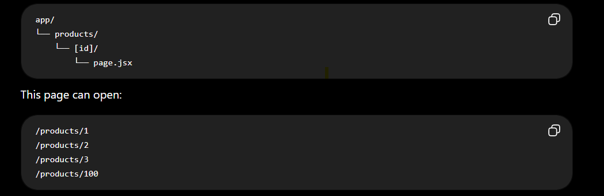

Question:

👉 How does Next.js know which product pages to generate during npm run build?

The answer is:

generateStaticParams() tells Next.js which dynamic pages should be created during the build process.

2. Simple Definition

generateStaticParams() returns a list of dynamic route values that Next.js should pre-generate as static pages during the build.

3. Real-Life Example

Imagine you are printing a book.

The book has 100 pages.

Before printing, the printer asks:

"Which pages should I print?"

You reply:

Page 1

Page 2

Page 3

Page 4

Page 5

The printer prints those pages.

Next.js works the same way.

Before building your project, it asks:

"Which product pages should I create?"

You answer using generateStaticParams().

4. Without generateStaticParams()

Folder:

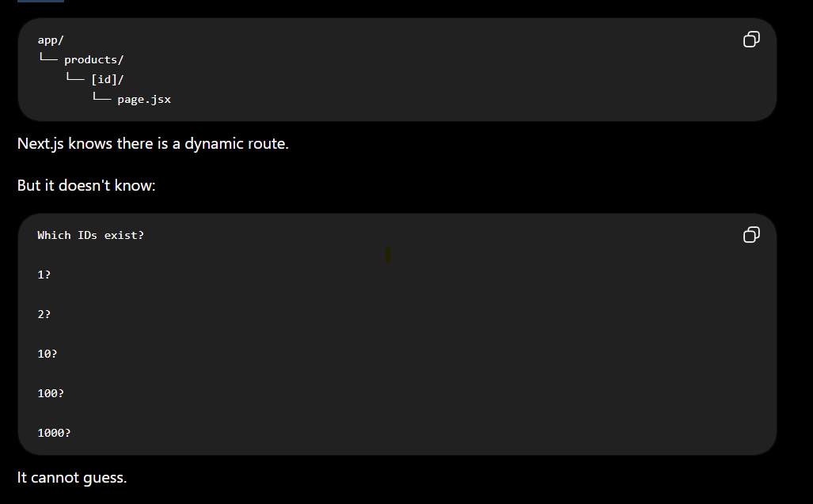

5. With generateStaticParams()

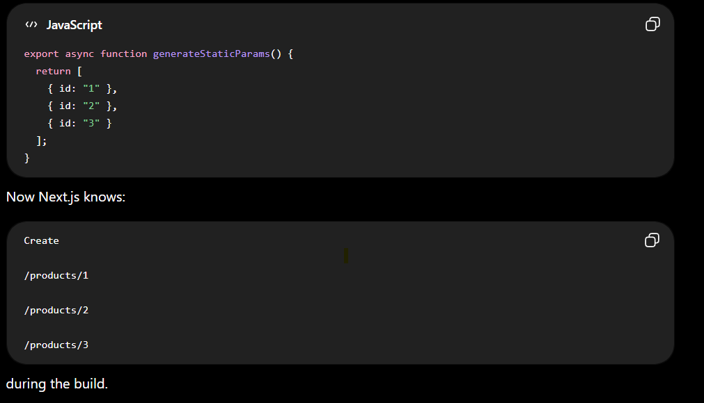

6. Folder Structure

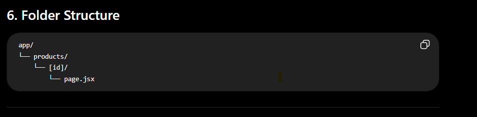

7. Basic Example

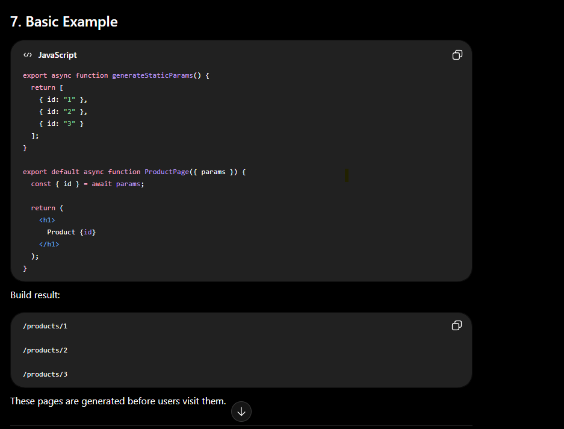

8. How It Works

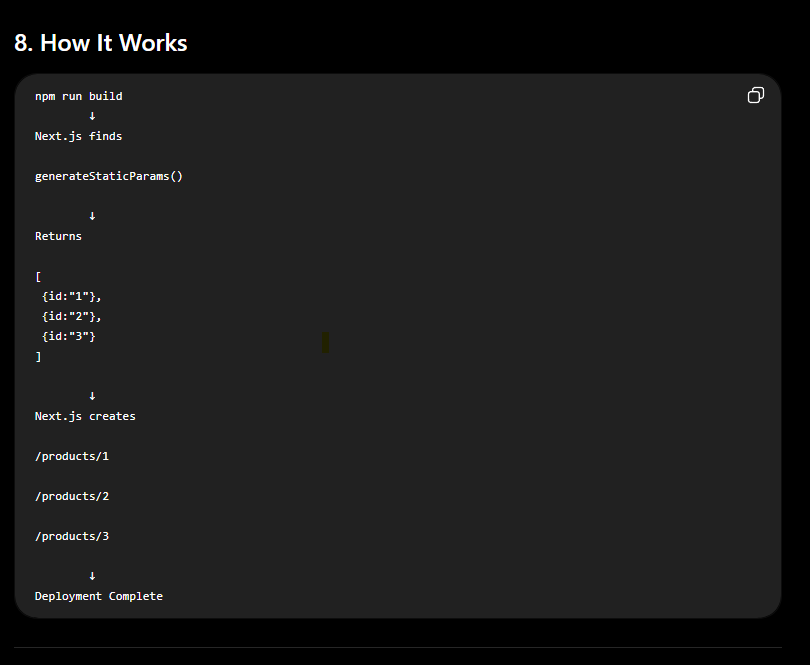

9. Real-Time Example (E-commerce)

Suppose your database has:

| Product ID |
| ---------- |
| 1          |
| 2          |
| 3          |
| 4          |
| 5          |

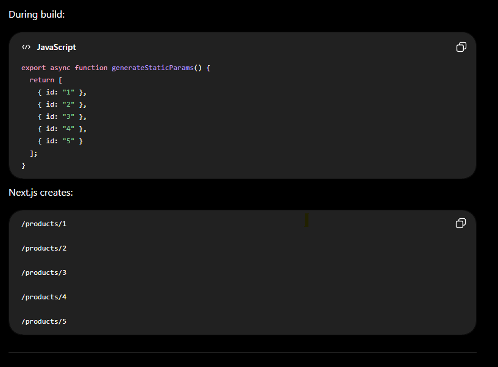

10. Fetch IDs from an API

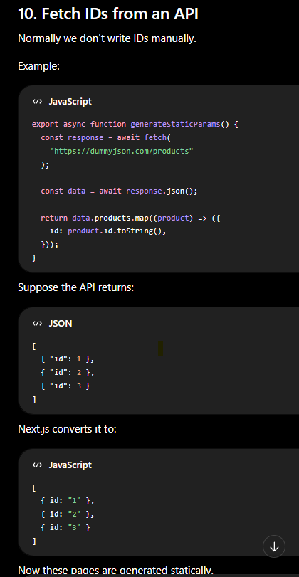

11. Complete Example

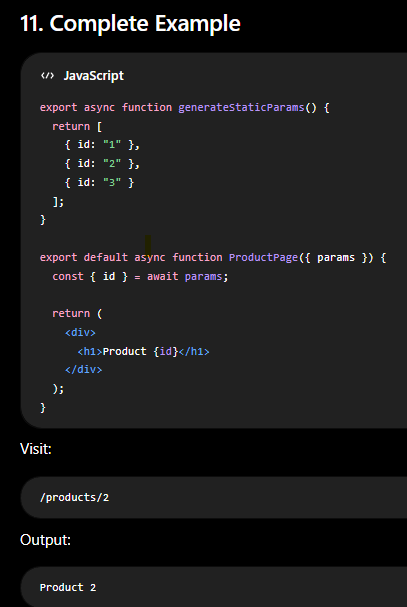

12. Why Do We Use generateStaticParams()?

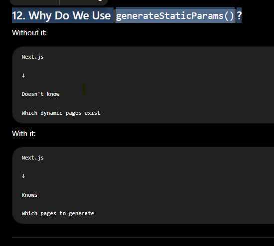

13. Real Project Example

Imagine an e-commerce website.

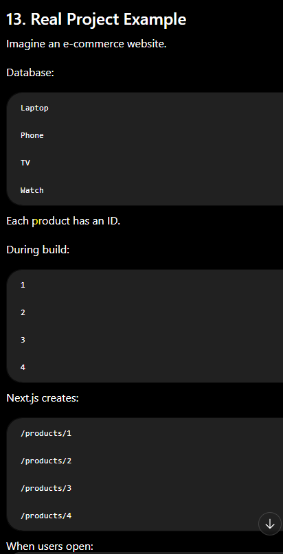

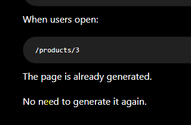

18. How to Know generateStaticParams() Is Working?

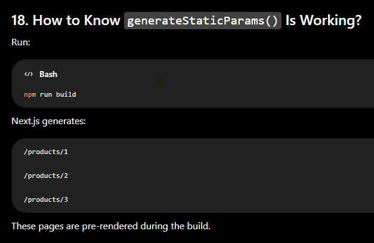

20. Interview Questions

Q1. What is generateStaticParams()?

Answer:

generateStaticParams() is a Next.js function used with dynamic routes. It returns the list of route parameters that Next.js should pre-render as static pages during the build process.

Q2. Why do we use generateStaticParams()?

Answer:

We use it to tell Next.js which dynamic routes should be generated at build time.

Q3. When is generateStaticParams() executed?

Answer:

During the build process (npm run build), before the application is deployed.

Q4. What does it return?

Answer:

It returns an array of objects.

Example:

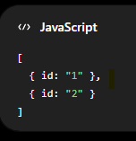

Q5. Does the object key matter?

Answer:

Yes.

The key must match the dynamic folder name.

Example:

Folder:

[id]

Return:

{
 id:"10"
}

| Topic     | Remember                                                         |
| --------- | ---------------------------------------------------------------- |
| Purpose   | Generate static dynamic pages                                    |
| Runs      | During `npm run build`                                           |
| Used With | Dynamic routes                                                   |
| Returns   | Array of objects                                                 |
| Folder    | `[id]`                                                           |
| Return    | `{ id: "1" }`                                                    |
| Generated | Before deployment                                                |
| Benefits  | Faster loading, SEO, no request-time generation for listed pages |

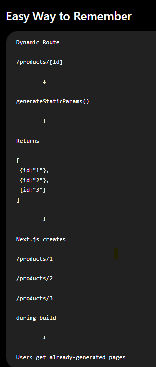

One-Line Definition (Interview)

generateStaticParams() tells Next.js which dynamic route values should be pre-generated as static pages during the build process.