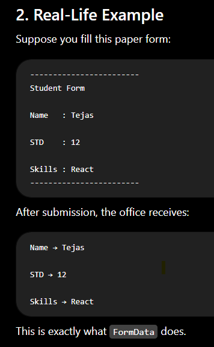
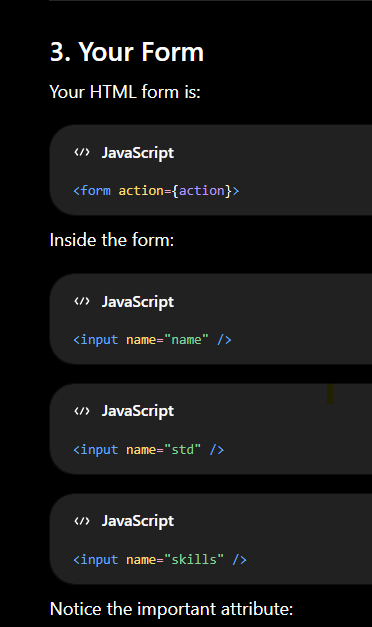
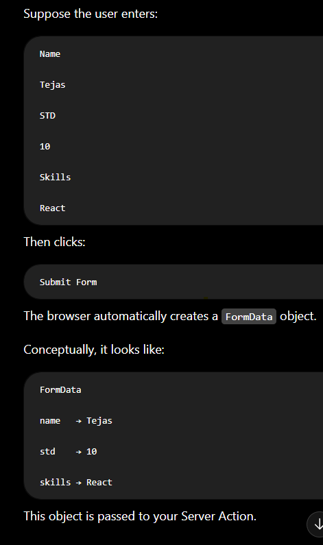
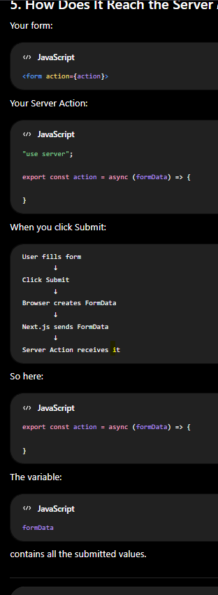
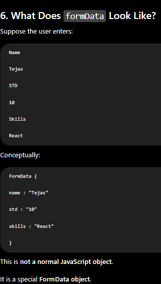
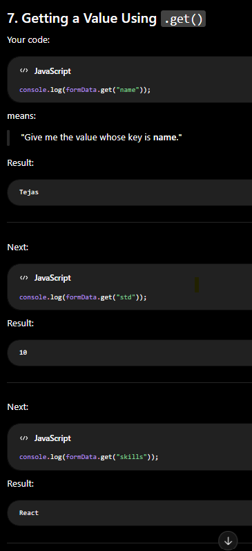
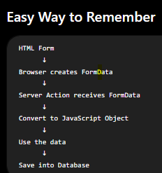

1. What is FormData?

Imagine you fill out a college admission form.

The form contains:

Name
Standard
Skills

When you click Submit, all the entered information is collected and sent to the college office.

Similarly, in HTML:

Name    : Tejas

STD     : 12

Skills  : React

When you click Submit, the browser collects all these values into a special object called FormData.

Simple Definition:

FormData is an object that stores all the data entered in a form as key-value pairs.

2. Real-Life Example

3. Your Form

4. What Happens When You Click Submit?

5. How Does It Reach the Server Action?

6. What Does formData Look Like?

7. Getting a Value Using .get()

16. Common Interview Questions
Q1. What is FormData?

Answer:

FormData is a JavaScript object that stores all form input values as key-value pairs. It is commonly used to send form data to the server.

Q2. Why do we use formData.get()?

Answer:

Because FormData is a special object, not a normal JavaScript object. The .get() method retrieves the value associated with a specific key.

Example:

formData.get("name");
Q3. What does formData.entries() return?

Answer:

It returns all form fields as key-value pairs.

Example:

[
 ["name", "Tejas"],
 ["std", "10"],
 ["skills", "React"]
]
Q4. Why use Object.fromEntries()?

Answer:

It converts the FormData entries into a normal JavaScript object, making it easier to access values with dot notation and destructuring.

Q5. Why is the name attribute important?

Example:

<input name="skills" />

Answer:

The name attribute becomes the key in the FormData object. Without it, the browser doesn't know what key to use for that input's value.

Interview Cheat Sheet

| Method                 | Purpose                                          |
| ---------------------- | ------------------------------------------------ |
| `formData.get("name")` | Get one field's value                            |
| `formData.entries()`   | Get all key-value pairs                          |
| `Object.fromEntries()` | Convert FormData into a normal JavaScript object |
| `name=""`              | Defines the key stored in FormData               |

Easy Way to Remember

One-Line Interview Answer

FormData is a special JavaScript object that automatically collects all form input values as key-value pairs when a form is submitted, allowing the server to easily access and process the submitted data.