1. What is useActionState()?

Imagine you are ordering food online.

When you click Place Order:

The order is sent to the restaurant.
The button shows Loading...
After processing, you see:
✅ Order placed successfully
❌ Payment failed

Instead of managing all this manually with useState, React provides useActionState().

Simple Definition

useActionState() is a React Hook that helps you submit a form, track its loading state, and receive the result returned by a Server Action.

2. Why Do We Need useActionState()?

Suppose you don't use it.

You would need:

const [loading, setLoading] = useState(false);

const [message, setMessage] = useState("");

Then you have to:

Set loading to true
Call the API/Server Action
Wait
Set loading to false
Store success/error message

Lots of manual work.

With useActionState():

const [state, submitForm, isPending] =
useActionState(insert_Action, null);

React manages most of this for you.

3. Your Code
const [state, submitForm, isPending] =
useActionState(insert_Action, null);

This line returns three values.

Think of it like this:

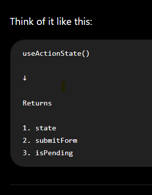

4. Understanding Each Value

First Value → state

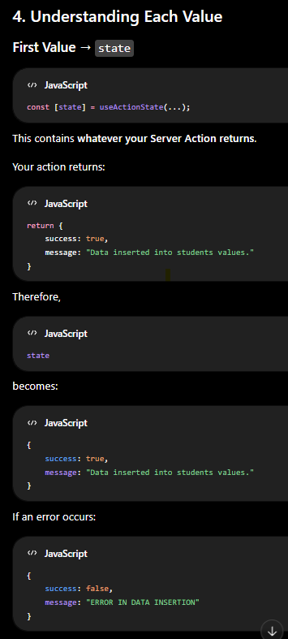

Second Value → submitForm

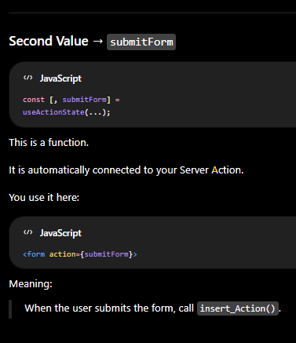

Third Value → isPending

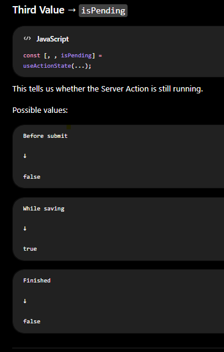

5. Visual Flow

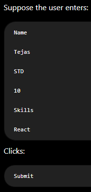

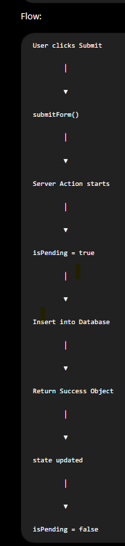

6. Understanding Your Server Action

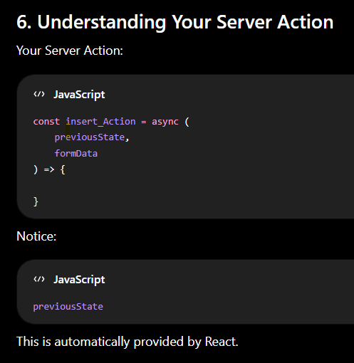

7. What is previousState?

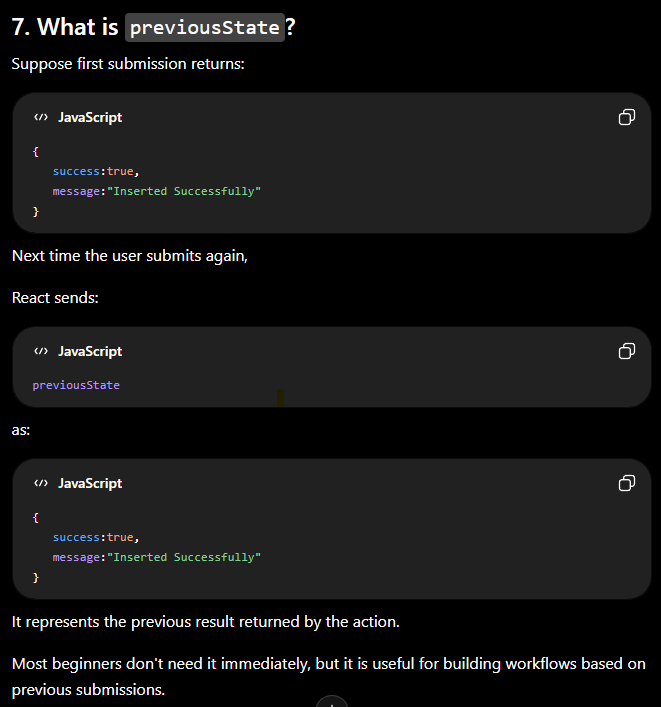

8. Understanding state

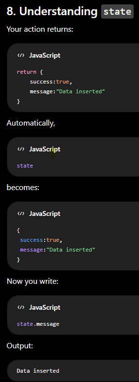

9. Why Can We Write?

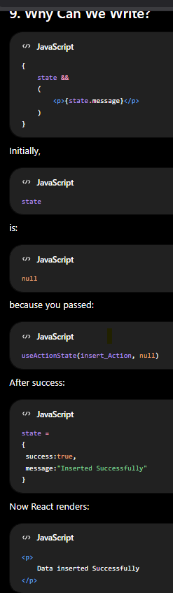

10. Understanding isPending

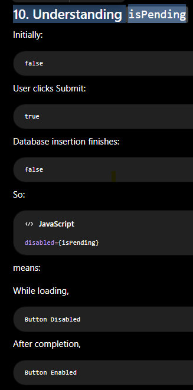

11. Button Example

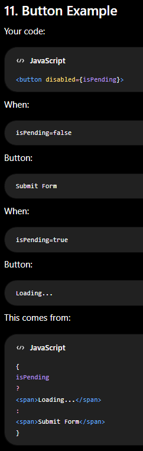

12. Real-Time Example

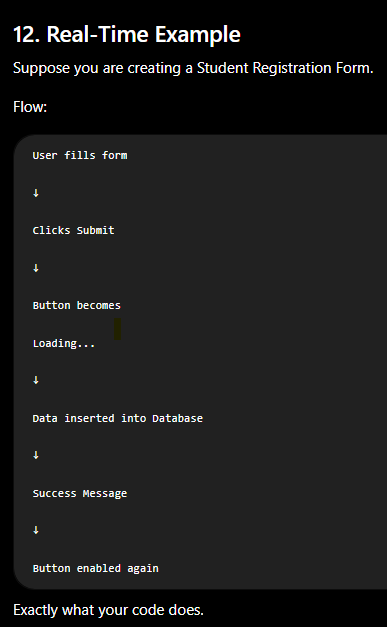

13. Complete Flow Diagram

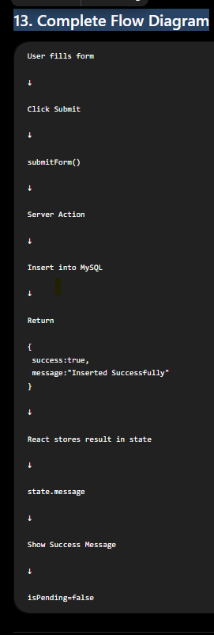

14. Understanding the Return Object

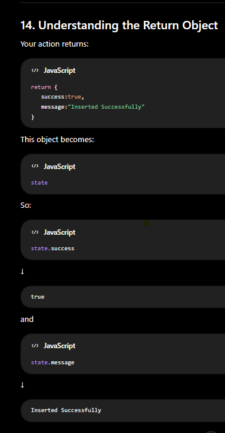

15. Why Do We Return an Object?

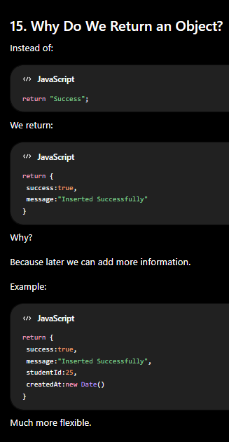

16. Why Not Use useState?

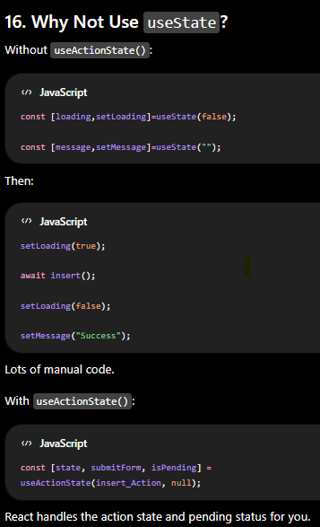

17. Difference Between useState and useActionState

| useState                     | useActionState                        |
| ---------------------------- | ------------------------------------- |
| Stores normal state          | Stores action result                  |
| Doesn't know about forms     | Built for forms and Server Actions    |
| Manual loading management    | Provides `isPending`                  |
| Manual success/error updates | Receives returned value automatically |

18. Real-Life Analogy

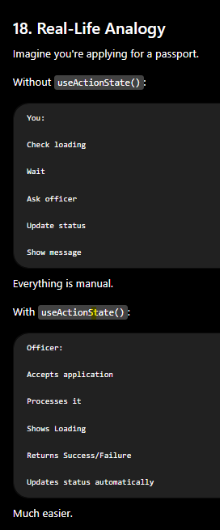

19. Common Interview Questions

Q1. What is useActionState()?

Answer:

useActionState() is a React Hook that connects a form with a Server Action. It manages the action result (state) and pending status (isPending) automatically.

Q2. What does useActionState() return?

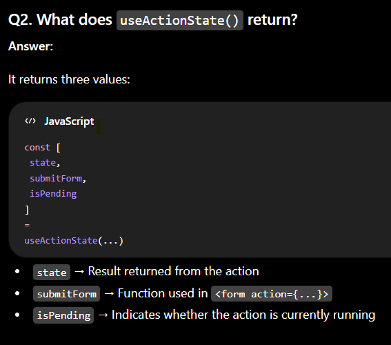

Q3. What is previousState?

Answer:

It contains the previous value returned by the Server Action.

Q4. What is state?

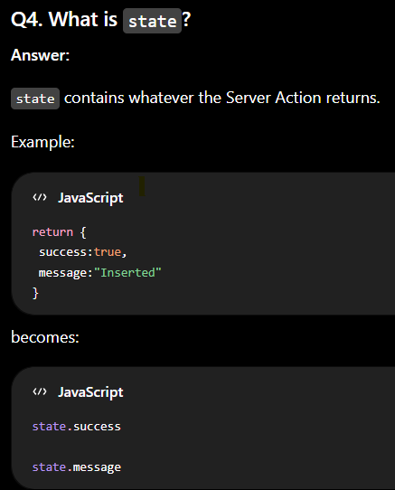

Q5. What is isPending?

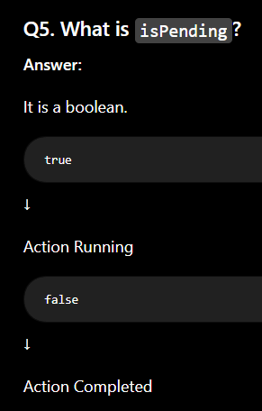

20. Interview Cheat Sheet

| Variable        | Meaning                                          |
| --------------- | ------------------------------------------------ |
| `state`         | Stores the value returned from the Server Action |
| `submitForm`    | Function connected to the form's `action` prop   |
| `isPending`     | Indicates whether the Server Action is running   |
| `previousState` | Previous action result                           |
| `formData`      | Submitted form values                            |

One-Line Interview Answer

useActionState() is a React Hook that simplifies form handling with Server Actions by automatically managing the returned action state, the form submission function, and the loading (isPending) status.

